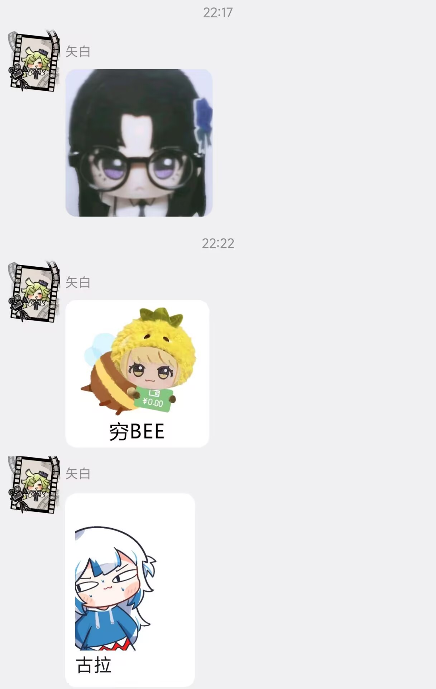
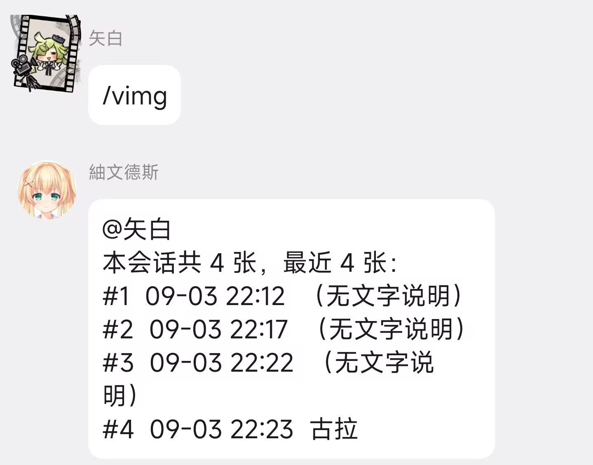
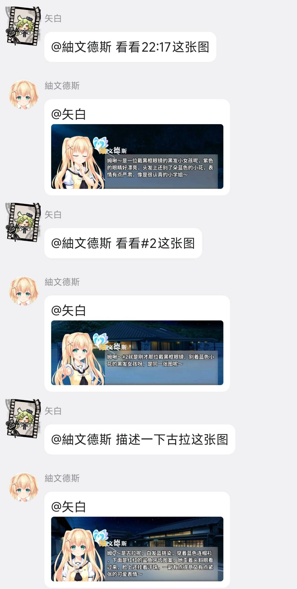

# visual_recall

让 AstrBot 里的 Agent **根据语境按需回看会话中出现过的历史图片**，而不是只能看见当前这一条消息里的图。

典型场景：用户先发了一张表情包，隔了几轮对话再问「看看这张图」。原生的 AstrBot 只把图片随当时的那一条消息送进上下文，等模型被问到时图早就不在视野里了。装上这个插件后，模型会知道「我这里有 #3 那张图」，需要时自己调工具把图调出来看。

无需艾特和引用即可看图，也不需要开启图片上下文。

## 工作原理

1. **捕获留档**：监听全部消息，同步将消息链内图片复制至插件数据目录，同时将会话、发送者、序号、文本、时间等元数据写入 SQLite 索引。AstrBot 事件结束会销毁临时媒体文件，不可异步执行复制，否则文件丢失。
2. **向模型告知存在图片**：Agent 会话启动钩子 `on_agent_begin`，通过 `run_context.messages` 注入系统消息，推送该会话的图片索引列表，告知模型可回看历史图片。> 注：Agent 模式不会触发 `on_llm_request`，因此只能使用 `on_agent_begin` 作为注入点，该步骤是功能生效的关键。
3. **召回渲染图片给模型**：模型需要查阅图片时调用 `recall_image` 工具，返回携带 base64 的 `CallToolResult`。AstrBot 的 `tool_loop_agent_runner.py` 会缓存图片，并追加携带真实图片的 user 消息进上下文，让模型真正读取图片内容，而非仅拿到文件路径文本。

## 前置条件

1. **模型供应商支持视觉**。这是硬条件。runner 会检查 provider 的 `modalities`，不含 `image` 时只会保留图片路径文字，模型看不到图像内容。
2. **AstrBot 版本够新**。本插件按 master 源码实现，依赖 `add_llm_tools`（v4.5.1+）、`on_agent_begin` 钩子、以及 runner 里那段「把工具返回的图片回注给 LLM」的逻辑（对应 `tool_image_cache`）。版本过旧时工具能调通，但模型看不到图。
3. 图片压缩需要 Pillow，没装也能跑，只是不压缩、按原图返回。

## 安装

在 AstrBot 控制台「插件市场 → 已安装 → 上传插件」上传即可。如果启报 AstrBot 版本不匹配，说明你的 AstrBot 低于 4.17.0，需要先升级。

目录结构：

```
astrbot_plugin_visual_recall/
├── metadata.yaml        AstrBot 据此识别插件（必需）
├── main.py              插件主体：捕获、注入、清理、调试命令
├── tools.py             recall_image 工具定义
├── storage.py           SQLite 索引
└── _conf_schema.json    配置项
```

## 配置

| 配置项                      | 默认   | 说明                    |
| ------------------------ | ---- | --------------------- |
| `enabled`                | true | 总开关                   |
| `inject_index`           | true | 是否注入图片索引，关掉后模型不会再主动召回 |
| `index_entries`          | 8    | 索引里最多列几张              |
| `max_images_per_call`    | 3    | 单次召回最多返回几张            |
| `max_image_edge`         | 1280 | 召回图片最大边长，超出等比压缩，0 关闭  |
| `max_store_mb`           | 15   | 单张超过此大小不入索引           |
| `max_images_per_session` | 60   | 每会话最多保留多少张            |
| `keep_days`              | 7    | 记录保留天数                |

## 指令

| 配置项           | 说明             |
| ------------- | -------------- |
| `/vimg`       | 查看索引列表         |
| `/vimg_clear` | 清空当前会话的索引与图片文件 |

## 使用

1.无需引用图片，无需附带图片，自动根据语境按需回看图片


2.llm根据序号/时间/备注 索引回看图片



1. 在会话里发一张图，附带一句文字（比如「这是柜门」）。
2. 发送 `/vimg`，应当能看到索引列表，例如 `#1 09-03 14:22 这是柜门`。
3. 隔一轮后问关于这张图的问题，例如「刚才那张柜门是什么颜色」。
4. 若模型正确调用了 `recall_image` 并描述了图片内容，说明链路打通。

`/vimg_clear` 可以清空当前会话的索引与图片文件。

## 补充说明

- 只能看到**本插件安装之后**发送的图片，更早的历史图片没有索引。
- 索引按会话隔离（`unified_msg_origin`），群 A 的图不会出现在群 B。
- 关键词检索匹配的是图片发送时**伴随的文字**。如果用户发图时没配文字，只能靠序号定位，这也是注入索引时要带上序号的原因。
- 每次召回都会把图片重新送进上下文，会消耗视觉 token。图片多或体积大时，把 `max_image_edge` 调小一些。
- 图片文件会占用磁盘，靠 `max_images_per_session` 和 `keep_days` 控制，清理每小时最多触发一次。
